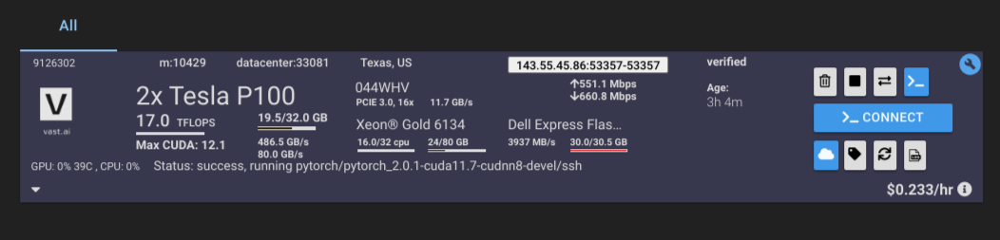

This is aceGPT model inference python app, I've used VAST.AI as a cloud gpu, the gpu specs as in the following picture:

only clone the repository, then give the setup_run.sh execution permission: 
```
chmod +x setup_run.sh
```
then run it using:
```
./setup_run.sh
```
after running use either gradio link, or `localhost:8080`
